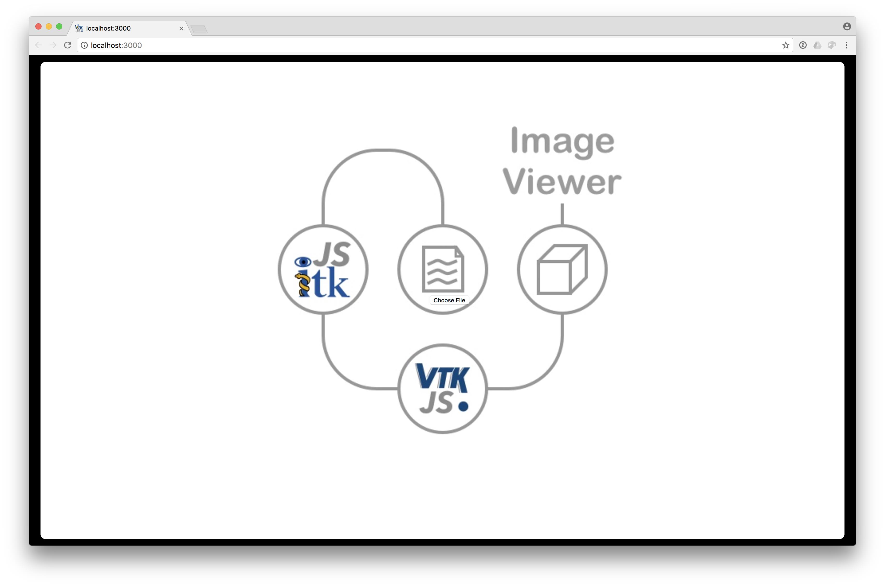

title: Command Line Interface
---

ITK/VTK Image Viewer can be used as a command line tool for opening and visualizing your local data file.

## Installation

First of all, you will need to install the tool on you system which will require Node.js.
Assumming your environment already has node, you should be able to run the following command line.

```sh
$ npm install itk-vtk-image-viewer -g
```

The command line will install globally the application which should enable a new command line:

```sh
$ ItkVtkImageViewer

  Usage: ItkVtkImageViewer [options]

  Options:

    -h, --help                        output usage information
    -V, --version                     output the version number
    -p, --port [3000]                 Start web server with given port
    -d, --data [directory]            Data directory to serve
    -s, --server-only                 Do not open the web browser
    
    -f, --filter [nrrd,png,tiff,bmp]  List files with those extensions in data directory
```

## Usage 

Listed above are the various options available, but below are commonly used commands:


### Quick start

Start a server on default port without automatically opening a browser and sharing your local `~/itk-data` directory as `/data`.

This allow to visualize file on the local file system via a given URL: 
- `http://10.21.3.245:3000/?fileToLoad=/data/005_20months_T2_Reg2Atlas.nrrd`

```sh
$ ItkVtkImageViewer -sd ~/itk-data

ItkVtkImageViewer
  => Serve /home/ItkConsortium/itk-data on port 3000

     en0 => http://10.21.3.245:3000/

  => Available data files:

    /?fileToLoad=/data/005_20months_T2_Reg2Atlas.nrrd
    /?fileToLoad=/data/005_32months_Reg2Atlas_ManualBrainMask.nrrd
    /?fileToLoad=/data/ScreenShot2017.png
```

### Drag and drop viewer

```sh
$ ItkVtkImageViewer -p
```


