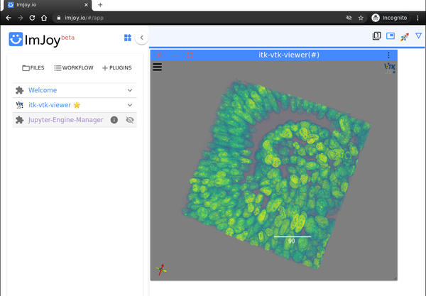

title: ImJoy Plugin
---

[](http://imjoy.io/#/app?plugin=https://kitware.github.io/itk-vtk-viewer/app/)

An *itk-vtk-viewer* plugin is available for [ImJoy](https://imjoy.io), a plugin powered hybrid computing platform for deploying deep learning applications such as advanced image analysis tools.



## Installation

Install the plugin into the workspace with the following [ImJoy Web App](http://imjoy.io/#/app?plugin=https://kitware.github.io/itk-vtk-viewer/app/) or [ImJoy Lite App](http://imjoy.io/lite?plugin=https://kitware.github.io/itk-vtk-viewer/app/) links with the plugin URI:

```
https://kitware.github.io/itk-vtk-viewer/app/
```

Note that the link can also be used directly.

To install a specific version, e.g. version `10.8.0`, use the URI:

```
https://unpkg.com/itk-vtk-viewer@10.8.0/dist/index.html
```

## Inputs

Supported context `data` inputs:

**image**: Image to be visualized. Can be:

- An [itk.js Image](https://insightsoftwareconsortium.github.io/itk-js/api/Image.html)
- A [scijs ndarray](http://scijs.net/packages/#scijs/ndarray) for JavaScript; for Python, it can be a [numpy](https://numpy.org) array.
- A [URL](https://developer.mozilla.org/en-US/docs/Web/API/URL/URL) pointing to an [image file supported by itk.js](https://insightsoftwareconsortium.github.io/itk-js/docs/image_formats.html).

For [scijs ndarray](http://scijs.net/packages/#scijs/ndarray), you can use the following function to encoded it into an imjoy-rpc encoded ndarray.
```
function encodeScijsArray(array){
  return {
    _rtype: 'ndarray',
    _rdtype: array.dtype,
    _rshape: array.shape,
    _rvalue: array.data.buffer,
  }
}
```

The `image` key is optional; one can also call `setImage()` later.

**pointSets**: An array of pointSet or a single pointSet to be visualized. Can be **an arrray** of imjoy-rpc encoded ndarray (as described in **image**):

The `pointSets` key is optional; one can also call `setPointSets()` later.


Context `config`:

An optional [viewer configuration](../config/) can be passed with the context `config`. To
retrieve the configuration from an existing viewer, call `viewer.getConfig()`.

Usage in javascript:
```javascript
const imageArray = ... // itk.js Image or imjoy-rpc encoded ndarray
const viewer = await api.createWindow({
  src: "https://kitware.github.io/itk-vtk-viewer/app/",
  data: { image: imageArray },
  config: config,
  })
```

Usage in Python
```python
from imjoy import api
import numpy as np

# a 2D or 3D numpy array
image_array = np.random.randint(0, 255, [500, 500], dtype='uint8')

async def setup():
    viewer = await api.createWindow(src="https://kitware.github.io/itk-vtk-viewer/app/", data={"image": imageArray}, config=config)

api.export({"setup": setup})
```

Displaying a point cloud in Python:
```python
import numpy as np
from imjoy import api

# make a point set array
gaussian_1_mean = [0.0, 0.0, 0.0]
gaussian_1_cov = [[1.0, 0.0, 0.0], [0.0, 2.0, 0.0], [0.0, 0.0, 0.5]]
number_of_points = 1000000
point_set_array = np.random.multivariate_normal(gaussian_1_mean,
                                                gaussian_1_cov,
                                                number_of_points)
point_set_array = point_set_array.astype('float32')

async def setup():
    viewer = await api.createWindow(
        src="https://kitware.github.io/itk-vtk-viewer/app/"
    )
    await viewer.setPointSets([point_set_array])

api.export({"setup": setup})
```
## API functions

In addition to the standard `setup` and `run` methods, the *itk-vtk-viewer* plugin exposes the full [viewer API](../api/).
